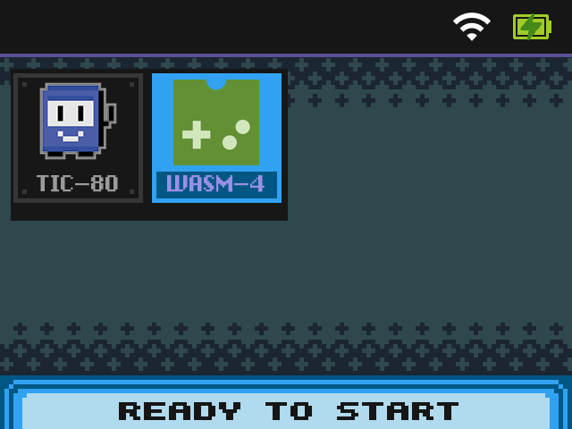
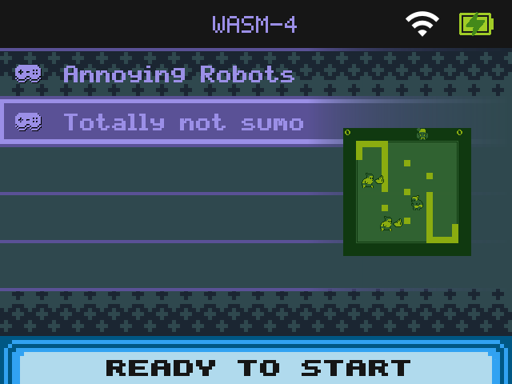
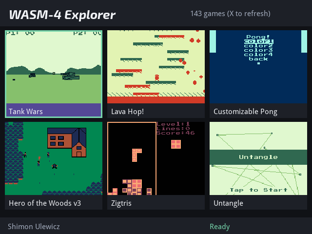

# WASM-4 Explorer for OnionOS

WASM-4 Explorer adds a WASM-4 runtime and a native catalog browser to OnionOS devices. The Explorer downloads the live WASM-4 gallery index on first run, loads thumbnails as you browse, installs selected carts into `Roms/WASM4`, and launches them through Onion's normal RetroArch flow.

## Screenshots

| WASM-4 in Games | WASM-4 game list | Explorer catalog |
| --- | --- | --- |
|  |  |  |

## Install

1. Download the latest `WASM4-Onion-v<version>.zip` release archive from [GitHub Releases](https://github.com/sulewicz/wasm4-explorer/releases).
2. Extract the zip, then copy the extracted folders to the root of your OnionOS SD card.
3. Boot the device and open `Apps -> Package Manager`.
4. Install both packages:
   - `Emu -> WASM-4`
   - `Apps -> WASM-4 Explorer`
5. Open `Apps -> WASM-4 Explorer`.

If you want installed games to appear under `Games -> WASM-4`, run Onion's normal `Refresh ROMs` action after installing games from the Explorer.

More detail is available in [docs/INSTALL.md](docs/INSTALL.md) and [docs/USAGE.md](docs/USAGE.md).

Release archives contain generated Onion Package Manager entries and the native Explorer binary. This source checkout contains the source and package inputs used to build those release archives.

## What It Stores

- Catalog index: `App/WASM4Explorer/cache/`
- Downloaded thumbnails: `App/WASM4Explorer/cache/images/`
- Installed carts: `Roms/WASM4/`
- Game artwork: `Roms/WASM4/Imgs/`
- WASM-4 metadata: `Roms/WASM4/.wasm4/`

The release package does not include a generated catalog, thumbnails, or ROMs.

## Releases And Updates

Versions are published as GitHub Releases with `v<major>.<minor>.<patch>` tags. See [docs/RELEASES.md](docs/RELEASES.md) for release contents, update behavior, and version identifiers.

This repository includes release-build scripts for users who want to build their own install archive. See [Build From Source](docs/RELEASES.md#build-from-source).

## License

Repository-owned code, docs, and package metadata are Copyright (C) 2026 Shimon Ulewicz and licensed under GPL-3.0-only. See [LICENSE](LICENSE) and [docs/ATTRIBUTION.md](docs/ATTRIBUTION.md).
